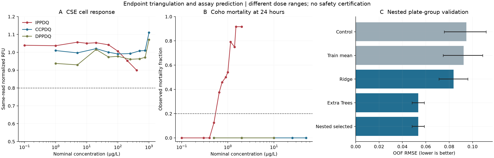

# TREADSENTINEL
## Cross-Endpoint Toxicity Assessment and Evidence-Gated Screening of 6PPD Alternatives

A reproducible, public-data computational study of which proposed tire
antiozonants need priority testing. It integrates measured fish mortality,
cellular responses, transformation-product evidence and nested machine learning.

**Paper title:** *TREADSENTINEL: Cross-Endpoint Toxicity Assessment and
Evidence-Gated Screening of 6PPD Alternatives.*

[Paper draft](docs/PAPER_DRAFT.md) · [Validation protocol](docs/VALIDATION_PROTOCOL.md) ·
[Model card](docs/MODEL_CARD.md) · [Rubric review](docs/REPOSITORY_REVIEW.md)



## Principal findings

- Only 2 of the 21 registry alternatives have explicitly matched product
  whole-fish evidence; 17 have no matched toxicity evidence in the included
  files. Missing evidence remains an open testing need.
- IPPDQ shows a cross-endpoint warning: no observed 20% CSE response within
  its tested range, despite substantial 24-hour coho mortality. Published
  extrapolated EC20s are not counted as observed effects. Agreement among
  the three overlapping products changes with the response threshold.
- IPPDQ nominal LC50 is 0.871 µg/L (tank-bootstrap interval 0.810–0.932);
  the unqualified measured-dose subset yields 0.785 µg/L (0.714–0.849).
  Other products lack a supported LC50 crossing and remain unestimated.
- Nested assay prediction selects Extra Trees: RMSE 0.0536 versus
  training-mean 0.0924 and ridge 0.0838. These results concern 1,377 dose
  means in 94 plate groups, with known assay conditions. Chemical holdout
  demonstrates important transfer limitations.

These are retrospective, within-release analyses. There is no independently
reserved external validation set and no evidence of commercial tire performance.
The software prioritizes evidence needs; it cannot certify a replacement as safe.

## Data and safeguards

The [USGS release](https://www.usgs.gov/data/toxicity-6ppd-alternatives-salmonids)
contains 1,006 coho records and 6,244 cell wells (CC0, DOI 10.5066/P1DHCMMZ).
The registry is a 2026-07-27 snapshot of 21
[California DTSC candidates](https://dtsc.ca.gov/scp/motor_vehicle_tires_containing_6ppd/)
plus the 6PPD benchmark. PubChem CASRN lookups supply candidate identity fields;
mixtures and polymers are not forced into one molecular structure.
ECOTOX and CompTox remain planned expansion sources.

Raw observations are unchanged. Tests reject duplicate fish/wells, invalid
values and absent controls. Controls match date/read, ozone, chemical, plate
and cell line. Shared physical plates stay together in cross-validation.
Technical wells are averaged, model selection is nested, and uncertainty
uses plate or tank resampling. Permutations and bootstrap samples are
statistical diagnostics of real observations, never additional training records.

The released data lack the six-hour control reference described in the study
metadata. Our same-read normalization is explicitly documented as an alternative,
rather than claimed as reproduction of the authors' EC estimates.

## Reproduce

Use Python 3.14 to match the tested version snapshot. The package declares
Python 3.11+ support; the current pinned environment and CI target 3.14.

```bash
python -m venv .venv
# Activate .venv with the command appropriate to your shell.
python -m pip install -r requirements-tested.txt -e ".[dev]"
python -m sixppd_assessment run
python -m sixppd_assessment verify
python -m pytest
ruff check src tests
ruff format --check src tests
```

All source files needed to reproduce the run are included. No download is
required. To deliberately refresh public data, use
`python scripts/download_public_data.py`; refreshing PubChem may change the
snapshot. Preserve the previous run receipt when comparing releases.

The default uses 19 dose-order permutations; use `--permutations 99` for
a finer exploratory diagnostic or `--permutations 0` for a quick development
run. Full runs take a few minutes depending on hardware.

## Outputs

| Question | Output in results/ |
|---|---|
| What needs testing? | decision_priorities.csv, evidence_matrix.csv, impact_brief.md |
| How do endpoints disagree? | orthogonal_endpoint_validation.csv, validation_overview.png |
| What do fish data support? | invivo_tank_summary.csv, invivo_mortality_summary.csv, fish_dose_response.csv |
| Does ozonation change the cell signal? | ozone_matched_dose_contrasts.csv (descriptive; batch-confounded) |
| Does the nonlinear model beat simple alternatives? | cell_assay_model_metrics.csv, cell_assay_model_oof_predictions.csv |
| Are splits and uncertainty auditable? | cell_assay_fold_audit.csv, cell_assay_chemical_holdout_metrics.csv, cell_assay_permutation_diagnostic.csv |
| Can the run be traced? | data_inventory.csv, cell_assay_normalized.csv, run_manifest.json |

Full definitions are in the [data dictionary](docs/data-dictionary.md).
CI reruns the pipeline and scientific regression tests and uploads its results.

## Next evidence milestone

Acquire independently curated, comparable fish toxicity studies; reserve
an untouched study/chemical set; then assess chemical descriptors with
scaffold-aware validation. Connect hazards to measured ozonation yields,
exposure and tire performance. The [modeling gates](docs/modeling-plan.md)
prevent premature safety prediction.

## Citation

Cite this software using [CITATION.cff](CITATION.cff), and separately cite the
original USGS data and report. The paper draft is an unpublished computational
reanalysis, not a new experimental study.
